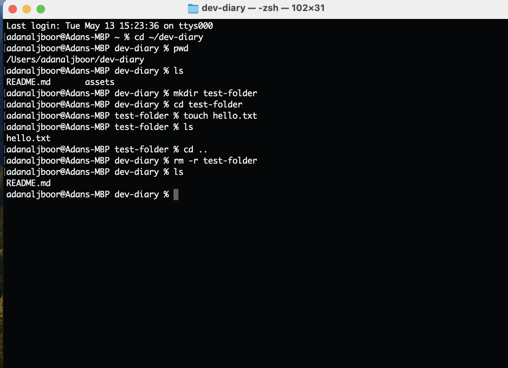

# My Dev Diary

## 👋 About Me
Hi there 👋 My name is **Adan**.  
I am a *graduate software engineer* learning **full-stack web development**.  
I love exploring websites, practicing `code`, and improving my skills every day.

## 🚀 What I Learned from *Good Developer Mindset*
- **Always keep learning and improving.**
- *Practice* is very important to get better.
- Solving problems helps me grow as a developer.

## 💻 What I Learned from Terminal Commands
I used these basic terminal commands:
- `ls` → list files
- `cd folder_name` → move between folders
- `mkdir folder_name` → create a new folder
- `touch file_name` → create a new file

Here is a screenshot of my terminal practice:

## 💡 My Developer Tips
- **Practice every day**, even small tasks.
- *Don’t be afraid of mistakes*, they help you learn.
- Take your time and enjoy the journey.
